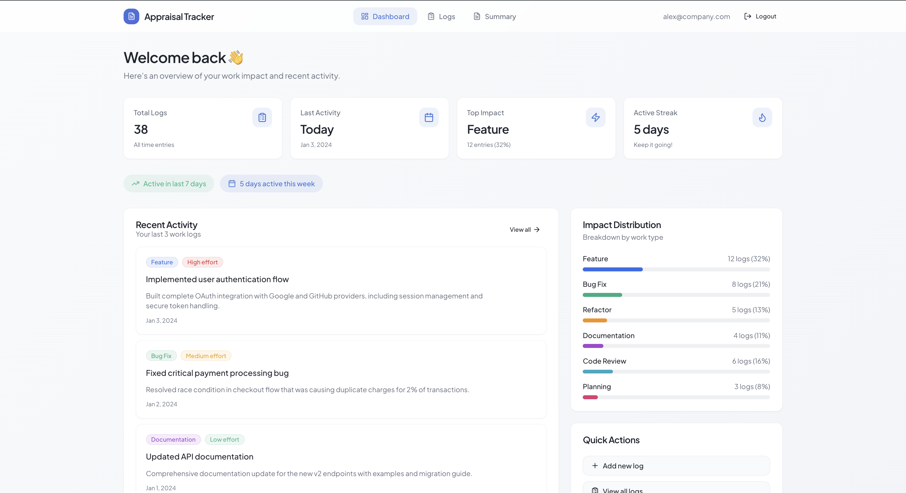
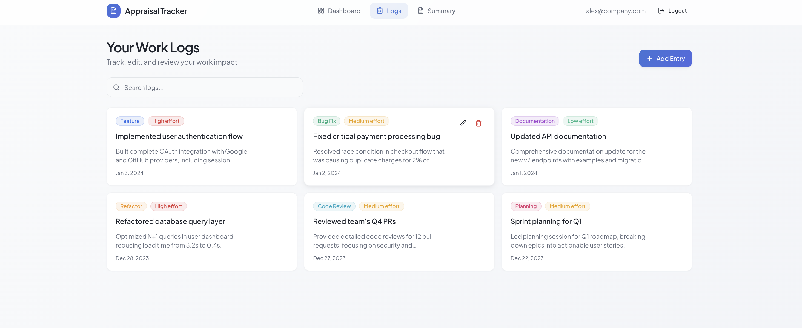
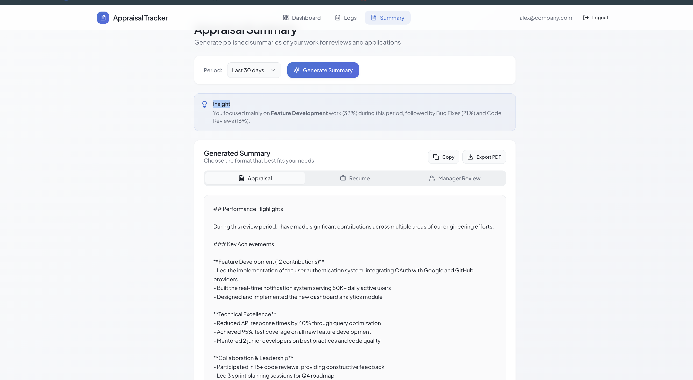

# 🚀 Appraisal Tracker

**Appraisal Tracker** is a modern web app that helps developers log their work, track impact, and generate **appraisal-ready summaries** for performance reviews, resumes, and manager updates.

Instead of scrambling before review cycles, Appraisal Tracker lets you build your impact **incrementally**, with clear insights into what you’ve delivered over time.

---

## ✨ Why Appraisal Tracker?

Most developers:

- Forget key contributions
- Undervalue bug fixes, refactors, and planning work
- Struggle to summarize months of work clearly

**Appraisal Tracker solves this by:**

- Turning daily work logs into structured impact
- Highlighting patterns (top impact areas, consistency, streaks)
- Generating polished summaries with AI (or smart fallback logic)

---

## 🧠 Key Features

### 📊 Dashboard

- Total logs overview
- Last activity & top impact type
- Activity streaks (consistency signals)
- Recent work highlights
- Impact distribution visualization

---

### 📝 Work Logs

Log work with:

- Title
- Description
- Impact type (Feature, Bug Fix, Refactor, etc.)
- Effort level

Additional features:

- Edit or delete entries
- Clean, card-based layout
- Semantic impact & effort pills

---

### 🧾 Appraisal Summary

Generate summaries for:

- Appraisals
- Resumes
- Manager reviews

Capabilities:

- Time-based ranges (e.g. last 30 days)
- AI-powered summary generation
- Intelligent fallback summaries when AI quota is unavailable
- Copy to clipboard
- Export to PDF

---

### 🔐 Authentication

- Passwordless login using **Supabase magic links**
- Secure session handling
- Auto-redirect on login / logout

---

### 🧩 Smart Insights (Non-AI + AI)

Even without AI, Appraisal Tracker provides:

- Dominant impact detection  
  _(e.g. “Bug Fix focused work”)_
- Activity consistency insights
- Impact breakdown summaries

AI enhances this further when available — **never blocking core functionality**.

---

## 🛠 Tech Stack

- **Frontend:** React + TypeScript  
- **Routing:** React Router  
- **Backend / Auth / DB:** Supabase  
- **Styling:** Inline styles (clean, minimal UI)  
- **PDF Export:** Client-side generation  
- **AI:** Gemini (with intelligent fallback)

---

## 🚧 Current Status

- ✅ Core product complete  
- ✅ Dashboard, logs, summaries implemented  
- ✅ Export & copy supported  
- ⚠️ AI quota dependent (fallback enabled by design)

### Planned Next

- Deployment (Vercel)
- README screenshots
- Optional public demo credentials

---

## 🌱 Future Enhancements

- Advanced AI insights (growth trends, role alignment)
- Resume-optimized summary templates
- Team / manager sharing
- Public SaaS version

---

## 🧑‍💻 Built By

**Harsh Kumar**  
Software Engineer | Full-Stack Developer

This project was built as:

- A personal productivity tool  
- A portfolio-grade SaaS prototype  
- A real solution to a real developer problem  

---

## 📸 Screenshots






---

## 📦 Project Structure (High-level)

```text
src/
├── components/
│   ├── Header.tsx
│   └── ...
├── pages/
│   ├── Dashboard.tsx
│   ├── Logs.tsx
│   ├── Summary.tsx
│   └── Login.tsx
├── lib/
│   └── supabase.ts
└── App.tsx
