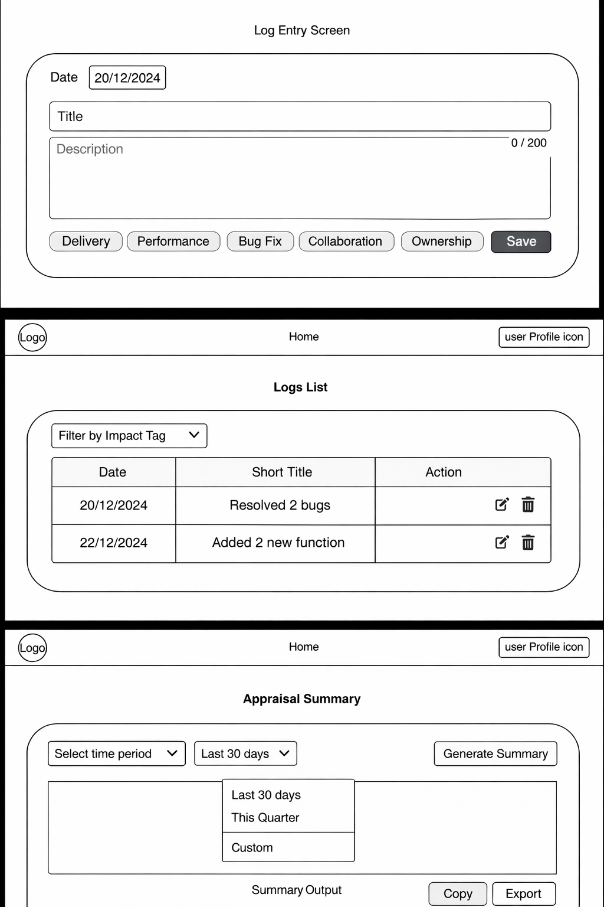

# Career Impact Tracker

Most professionals struggle during appraisals because they forget
what they worked on and fail to quantify their impact.

Career Impact Tracker helps users log their daily/weekly work
and automatically converts it into appraisal-ready impact summaries.

## Problem
- Appraisal self-reviews are written in a rush
- Achievements are forgotten or poorly articulated
- Impact is rarely quantified

## Solution
A simple tool to:
- Log work in under 60 seconds
- Tag impact areas (delivery, performance, collaboration, etc.)
- Generate AI-powered appraisal summaries

## MVP Features
- User authentication
- Daily/weekly work logs
- Impact tagging
- Appraisal period selection
- AI-generated appraisal summary

## Wireframes

Early-stage wireframes focused on speed, clarity, and daily usability.

### Log Entry
- Quick daily logging (under 60 seconds)
- Impact tagging for appraisal alignment

### Logs List
- Chronological view of work
- Quick edit and delete actions
- Filter by impact type

### Appraisal Summary
- Time-based summaries (30 days, quarter, custom)
- AI-generated appraisal-ready output
- One-click copy/export

## Tech Stack
- Frontend: Next.js / React
- Backend: Next.js API routes
- Database: Supabase (Postgres)
- AI: OpenAI API
- Auth: Supabase Auth

## Why This Project
This project solves a real problem I personally face and demonstrates
product thinking, system design, and AI integration.
